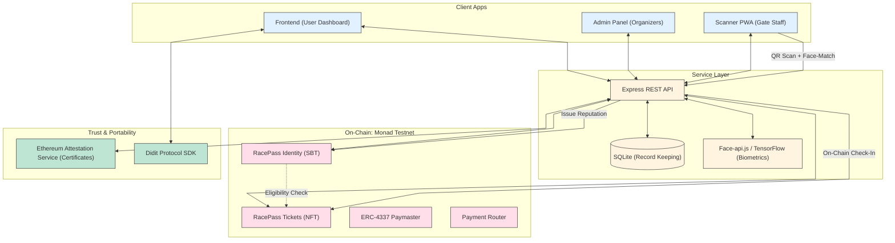

# 🏎️ RacePass — Universal Identity & Reputation Layer

> **Verify once. Race everywhere.**
>
> RacePass is a blockchain-powered, privacy-preserving identity and reputation protocol for events, fintech platforms, and digital marketplaces. Inspired by the universally portable racing license concept, it lets users carry a single verified identity across any platform — backed by cryptographic proofs and on-chain smart contracts.

---

## ✨ Key Features

| Feature | Description |
|---|---|
| 🆔 **Portable Identity (SBT)** | KYC once, reuse everywhere. A non-transferable Soulbound Token (SBT) anchors your verified identity on-chain. |
| 🛡️ **Cross-Chain EAS Certificates** | Uses **Ethereum Attestation Service (EAS)** for portable, chain-agnostic proofs. Verify your Monad-based reputation on Polygon, Sepolia, or Base without needing a bridge. |
| 👤 **Biometric Wallet-Binding** | Facial embeddings are cryptographically hashed and attached to the user's RacePass. Prevents ticket sharing or QR-code hand-offs by requiring a face-match at the gate. |
| 🎟️ **Programmable Smart Tickets** | NFT tickets that enforce identity, age, and reputation checks during every transfer, natively killing scalping. |
| ⏳ **Reputation "Tire Wear" Decay** | On-chain reputation that decays with inactivity and grows by attending events — encouraging continuous good behaviour. |
| 💸 **Blockchain-Native Payments** | MON and ERC-20 token payments & escrow through smart contracts on Monad Testnet. |
| 📱 **Bio-Scanner App (PWA)** | A mobile-first PWA for gate staff that performs real-time QR validation + AI face-matching against on-chain embeddings. |

---

## 🏗️ System Architecture



---


## 🛠️ Tech Stack

### Frontend & Apps
| Layer | Technology |
|---|---|
| Framework | [Next.js 16](https://nextjs.org/) + React 19 |
| Styling | Tailwind CSS v4 |
| Web3 | [wagmi v3](https://wagmi.sh/) + [viem](https://viem.sh/) |
| Auth | Sign-In with Ethereum (SIWE) via `next-auth` |
| Identity SDK | [Didit Protocol](https://didit.me/) |
| Animations | Framer Motion |
| PWA | `@ducanh2912/next-pwa` |

### Blockchain Backend
| Layer | Technology |
|---|---|
| Network | [Monad Testnet](https://monad.xyz/) (Chain ID: 10143) |
| Smart Contracts | Solidity 0.8.28 (ERC-721, OpenZeppelin) |
| Tooling | [Hardhat](https://hardhat.org/) + Hardhat Ignition |
| Identity Standard | EAS (Ethereum Attestation Service), EIP-712 |
| **AI/Biometrics** | `Face-api.js` + TensorFlow.js (for facial embedding generation) |
| Backend API | Node.js + Express + Ethers.js v6 |
| Database | SQLite3 (reputation logs, attestation records, encrypted embeddings) |

### Secondary Networks (Configured)
- **Polygon Amoy** (Testnet) — Cross-chain portability experiments
- **Sepolia** (Testnet) — General Ethereum compatibility testing

---


## 📡 Backend API Reference

Base URL: `http://localhost:3000`

| Method | Endpoint | Description |
|---|---|---|
| `POST` | `/sendPayment` | Send MON tokens to a recipient via the Payment contract |
| `POST` | `/lock` | Lock MON or USDC tokens in the escrow contract |
| `GET` | `/my-balance` | Get the server wallet's MON balance |
| `GET` | `/balance/:address` | Get MON balance for any wallet address |
| `GET` | `/network-info` | Get current network and contract information |

### Example: Send Payment
```bash
curl -X POST http://localhost:3000/sendPayment \
  -H "Content-Type: application/json" \
  -d '{"receiver": "0xABC...", "amount": "0.1", "token": "MON"}'
```

---

## 📜 Smart Contracts

### `RacePassIdentity.sol`
- **Standard:** ERC-721 (Soulbound — transfers blocked)
- **Purpose:** Issues a non-transferable identity token (SBT) per user.
- **Biometric Layer:** Stores a cryptographic hash of the user's facial embeddings to ensure "Proof-of-Presence" at events.
- **Key Functions:**
  - `issueIdentity(address, isKycVerified, isOver18, reputation)` — Mint an SBT after ZKP and Biometric enrollment.
  - `getActiveReputation(tokenId)` — Returns reputation score with time-decay applied.
  - `checkEligibility(address, requireAge18, minReputation)` — Used by ticket contracts to gate access.
  - `addReputation / deductReputation` — Managed by the trusted verifier / event contracts.

### `RacePassTicket.sol`
- **Standard:** ERC-721 (Programmable NFT Ticket)
- **Purpose:** Event access passes that enforce compliance rules on every transfer.
- **Key Functions:**
  - `issueTicket(address, eventName, requireAge18, minReputation, maxResalePrice)` — Mint a ticket only to eligible wallets.
  - `checkIn(tokenId, eventName)` — Gate staff marks a ticket as used.
  - Transfer hook (`_update`) — Rejects transfers to wallets that fail eligibility checks.

### `RacePassPaymaster.sol`
- ERC-4337 compliant Paymaster — Allows event organizers to sponsor gas fees for attendees (gasless UX).

### `Payment.sol`
- Lightweight MON payment router used by the REST backend.

---


## 🔐 Environment Variables Summary

| Variable | Used In | Description |
|---|---|---|
| `PRIVATE_KEY` | `blockcahin/` | Wallet private key for signing transactions |
| `MONAD_RPC_URL` | `blockcahin/` | RPC endpoint for Monad Testnet |
| `MONAD_CHAIN_ID` | `blockcahin/` | Chain ID for Monad (default: `10143`) |
| `MONAD_PRIVATE_KEY` | `blockcahin/` | Separate key for Monad (can be same as `PRIVATE_KEY`) |
| `PAYMENT_ADDRESS` | `blockcahin/` | Deployed `Payment.sol` contract address |
| `INFURA_API_KEY` | `blockcahin/` | Infura key for Sepolia/Polygon Amoy |
| `NEXT_PUBLIC_API_URL` | `scanner-app/` | Backend API base URL for the scanner PWA |

---
